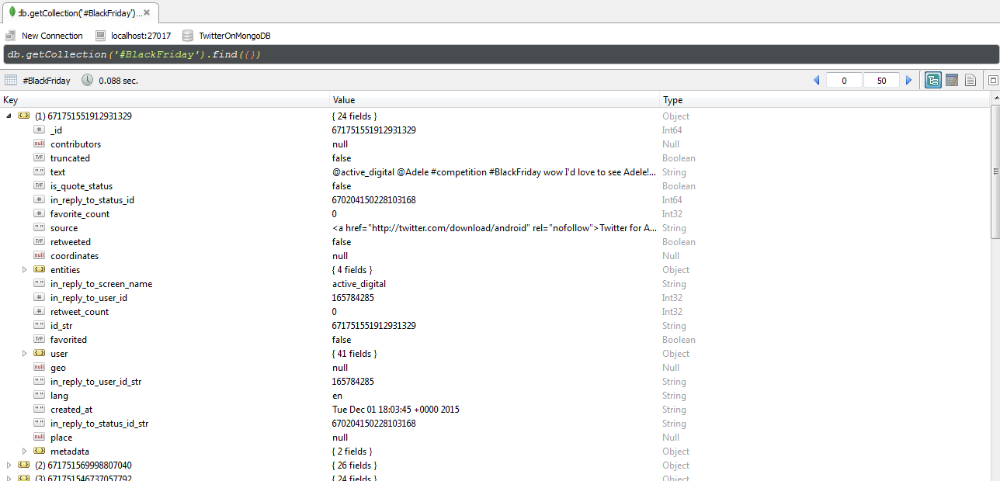
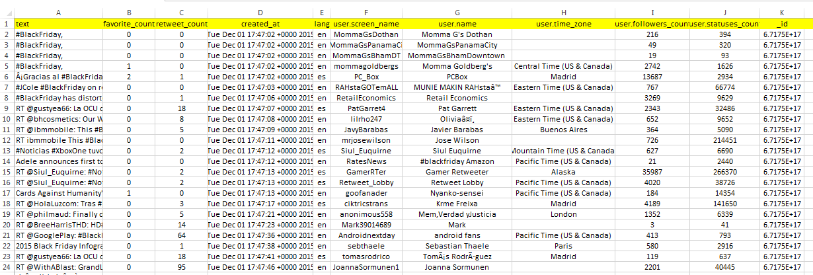

# Twitter-MongoDB-CSV-XLS
Here, is a simple tool to extract tweets, load them into a MongoDB instance and export them into CSV/XLS format. You can use the data in the final CSV/XLS file for further analysis or simply connect to the data in JSON format in the MongoDB instance.

<h1>How To Use The Tool</h1>

1. Ensure you have the right version of Python installed (2.7 or higher)

2. Set up a local MongoDB instance and make sure it is up and running. 
   By default, MongoDB instance should accept connections via port 27017.
   
3. Create an account on http://dev.twitter.com and get your API keys
   You would need 4 parameters to get going - consumer key, consumer secret, access token & access token secret
   
4. Run the attached Python script and input the desired Twitter Handle or Hashtag. The script will extract a maximum of ~3000 tweets for the specified user or hashtag.                                                                                                                                                                             
5. The retrieved tweets in JSON format, are then loaded into the local MongoDB instance as a separate collection.             
 
6. The script then exports this entire collection into a CSV/XLS file, by invoking the mongoexport functionality on command line.    

7. I re-use the "id" field, returned by Twitter, as the primary key (PK) "_id" for the MongoDB collection. This ensures that duplicate tweets are not inserted into the DB; therefore, you can run this program regularly (say on a daily basis) to load the recently posted tweets to your existing collection
